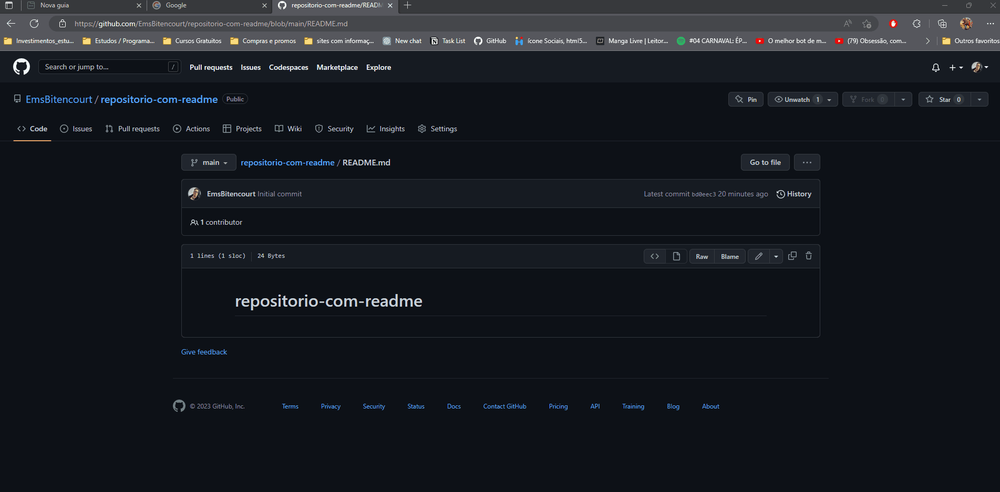

# Projeto com README
Um projeto teste com um arquivo README 🚀

[]

## Tecnologias Utilizadas:
- Python
- HTML
- CSS
- JS (Basic)

## Como utilizar

1 - Clone do projeto usando git clone
```
git clone https://github.com/EmsBitencourt/repositorio-com-readme.git
```

2 - Acesse a pasta do projeto
```
cd repositório-com-readme
